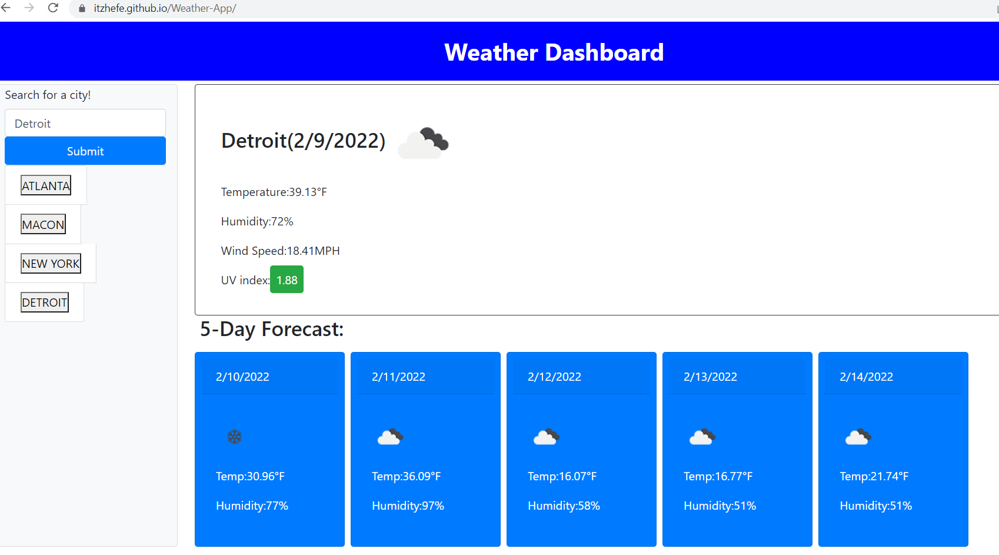

# Weather-App

* The weather app is built using HTML, CSS, JS, Bootstrap and JQuery

* Designed to provide to up date weather forecasting for searched cities.

* When a user searches a city then the dashboard and 5 day forecast are populated with that cities weather report.

* The recently searched cities will appear as a list below the search bar as they are searched.

## Links to GitHub and deployed page:

[Weather App deployed page:](https://itzhefe.github.io/Weather-App/)

[GitHub Repo:](https://github.com/ItzHefe/Weather-App)

## Screenshots of the working application:

### Weather App Landing Page:

### Recent Searches:

